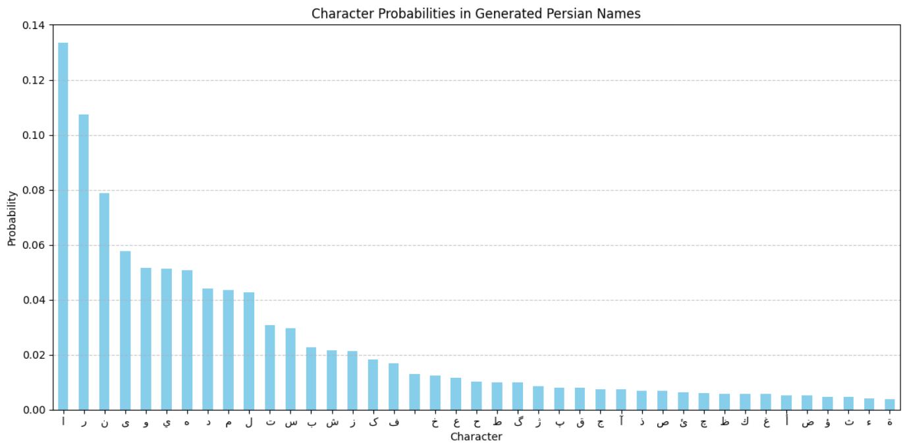

## Persian Name Generation with Neural Network

This project demonstrates how to train a character-level neural network using PyTorch to generate Persian names. It uses a dataset of 8,888 real names and builds a simple yet effective model that learns the structure of Persian names and generates new ones character by character.

## 🚀 Project Overview

- **Goal**: Generate realistic Persian names by predicting character sequences.
- **Method**: Train a neural network that learns name structures at the character level.
- **Visuals**: Includes clear visualizations for loss tracking, name length distribution, and character frequency in generated names.

## 📊 Visualizations

Interactive charts available :
- Training Loss Curve
  

- Top Character Frequencies in Generated Names

## 🛠️ Technologies Used

- **Python 3**  
- **PyTorch** – For model training  
- **Pandas** – For data preprocessing  
- **Scikit-learn** – For train/test split  
